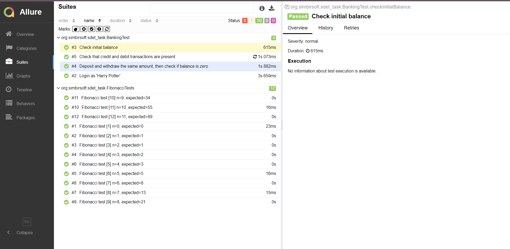

# Тестовое задание на позицию Java SDET @ Simbirsoft
## Запуск приложения
Для запуска приложения необходимо выполнить следующие команды:
- ```docker compose up -d```
- ```./gradlew test```
## Конфигурация приложения
Для изменения параметров подключения к Selenium Grid нужно изменить соотвествующие параметы в application.yml 
(`selenium.grid.url=http://localhost:4444` по умолчанию, для корректной работы с docker compose)
## Отчет Allure
Автоматически сгенерированный Allure отчет будет помещен в директорию `allure-reports`
### Пример отчета

## Экспорт транзакций
Экспортированные транзакции будут находиться в файле `export/export_transactions.csv` по умолчанию. 
Расположение можно поменять в application.yml (значение параметра`transactions.export.filepath`)
### Пример экспортированных транзакций (файл находится по указанному пути в репозитории)
| С1 | С2 | С3 |  
|-----------|:-----------:|-----------:|  
| 10 September 2023 10:15:55 | 55 | CREDIT |  
| 10 September 2023 10:15:56 | 55 | DEBIT |

